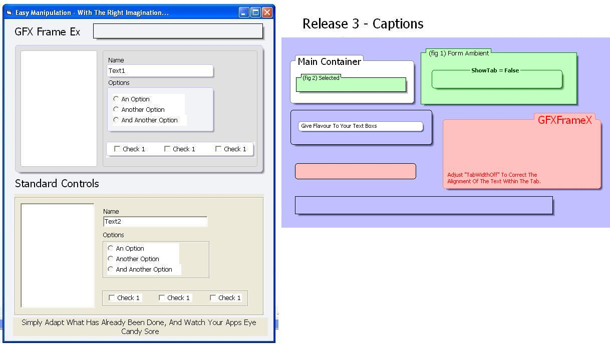



## GFX Frame Control Release 3\.2

### Description

*** RELEASE 3 *** A Simple Container Which Allows You To Add Depth To Your Forms. Now Supports Rounded Corners, Shadow On And Off And Border Colour, Caption (On\Off), Alignment, Show Tab, Font + Colour. See Screen Shot, Now All It Takes Is A 'Little' Imagination...

BUG FIX:The control interfered with the Left$ and Right$ commands, this has now been rectified (Changed The Alignement Enum Members Names). Sorry if this caused you problems, but it's now fixed.
 
### More Info
 

             |
---                |---
**Submitted On**   |2007-08-19 12:10:02
**By**             |[Steven Atkiss](https://github.com/Planet-Source-Code/PSCIndex/blob/master/ByAuthor/steven-atkiss.md)
**Level**          |Intermediate
**User Rating**    |5.0 (90 globes from 18 users)
**Compatibility**  |VB 5\.0, VB 6\.0
**Category**       |[Custom Controls/ Forms/  Menus](https://github.com/Planet-Source-Code/PSCIndex/blob/master/ByCategory/custom-controls-forms-menus__1-4.md)
**World**          |[Visual Basic](https://github.com/Planet-Source-Code/PSCIndex/blob/master/ByWorld/visual-basic.md)
**Archive File**   |[GFX\_Frame\_2079978192007\.zip](https://github.com/Planet-Source-Code/steven-atkiss-gfx-frame-control-release-3-2__1-68872/archive/master.zip)

